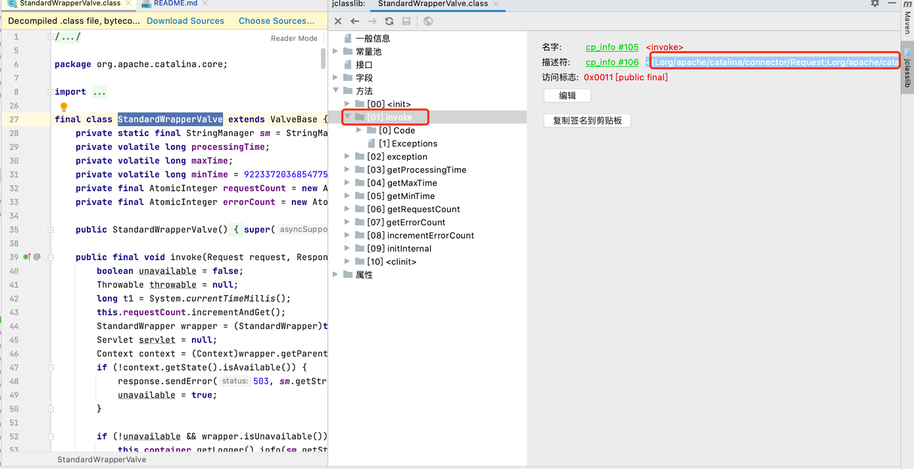

# jrasp-module

## 简介

jrasp-agent 的安全模块，目前支持的模块有： 

- 1.命令执行模块 （windows native、unix native）
- 2.反序列化模块（jdk反序列化、fastjson、yaml、stream）
- 3.http模块（springboot、tomcat、jetty、undertown、spark）（IP黑名单、URL黑名单、扫描器识别）
- 4.xxe模块 （dom4j、jdom、jdk）
- 5.文件访问模块（io、nio、apache-common-io）
- 6.表达式注入模块（spel、ognl）
- 7.sql注入（mysql）
- 8.JNDI注入
- 9.SSRF 
- 10.danger protocol  (进行中)
- 11.DNS查询  (进行中)
- 12.Memory
- 13.类加载器 (进行中)
- 14.attach (进行中)

## 模块编译

无需单独编译，jrasp-agent 整体编译打包时包含模块中的全部项目。

## 开发规范


### 模块包名称

模块的包名称必须以`com.jrasp.agent.module`开头


### 日志框架引入

在模块中引入下面的代码，即可打日志。

```java
@RaspResource
private RaspLog logger;
```

实现的原理：jrasp框架负责将实际的日志对象实例注入到对应的模块中（类似于spring的依赖注入机制）

### 模块中输出日志

输出攻击日志

```java
logger.attack(AttackInfo attackInfo);
```

输出模块自身日志

```java
logger.info(String message);
```

### 模块引入依赖

比如模块Hook的类在`运行时`的 tomcat 中，为了避免反射，在编译时必须引入tomcat依赖，因此依赖项的`scope`必须为`provided`

```java
<dependency>
    <groupId>org.apache.tomcat</groupId>
    <artifactId>tomcat-catalina</artifactId>
    <version>9.0.56</version>
    <scope>provided</scope><!--运行环境提供-->
</dependency>
```

或者将运行时获取的类和方法写入到`jrasp-maven`工程中
例如
```java
package com.mysql.cj.jdbc;

/**
 * 这里的类和方法保证模块编译时通过即可，实际依赖是运行时真实的类
 * mysql8.0
 */
public class ClientPreparedStatement {
    public String getPreparedSql() {
        return "";
    }
}
```

### 模块类匹配

以 rce-hook 模块为例子，在创建类`java/lang/UNIXProcess`匹配规则时：

```json
forkAndExec(I[B[B[BI[BI[B[IZ)I
```

#### 获取描述符号的方法

##### 方式1：解压类所在的jar包并反编译

解压`rt.jar`包（类所在的jar包）后（解压命令：jar -xvf rt.jar）:

`javap -v java/lang/UNIXProcess.class` 反编译class即可

获取方法的内部描述`(I[B[B[BI[BI[B[IZ)I`

##### 方式2：安装 jclasslib IDEA 插件 　(推荐)
以`org.apache.catalina.core.StandardWrapperValve#invoke(org.apache.catalina.connector.Request, org.apache.catalina.connector.Response)`
为例子说明：



描述符：`(Lorg/apache/catalina/connector/Request;Lorg/apache/catalina/connector/Response;)V`

当然，熟悉方法的内部描述规则之后，也可以自己写出。

